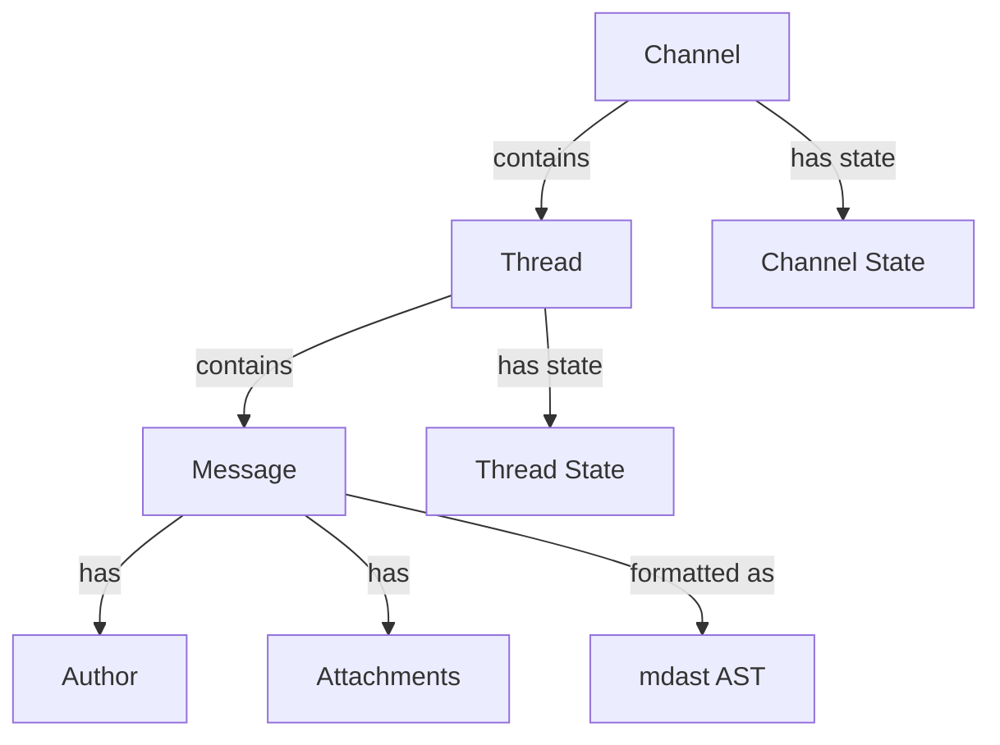

The Chat SDK organizes conversations around three core concepts: **Threads**, **Messages**, and **Channels**. Understanding how these work together is essential for building chat applications.

## Thread

A `Thread` represents a conversation context where messages are exchanged. It's the primary interface for posting messages, managing state, and subscribing to updates.

```typescript
interface Thread<TState = Record<string, unknown>, TRawMessage = unknown> {
  readonly id: string;           // Unique thread ID
  readonly channelId: string;    // Parent channel ID
  readonly isDM: boolean;        // Whether this is a DM conversation
  readonly adapter: Adapter;     // Platform adapter
  
  // State management
  readonly state: Promise<TState | null>;
  setState(state: Partial<TState>, options?: { replace?: boolean }): Promise<void>;
  
  // Message operations
  post(message: string | PostableMessage | CardJSXElement): Promise<SentMessage>;
  postEphemeral(user: string | Author, message: AdapterPostableMessage, options: PostEphemeralOptions): Promise<EphemeralMessage | null>;
  startTyping(status?: string): Promise<void>;
  
  // Subscription
  isSubscribed(): Promise<boolean>;
  subscribe(): Promise<void>;
  unsubscribe(): Promise<void>;
  
  // Message iteration
  readonly messages: AsyncIterable<Message>;      // Newest first
  readonly allMessages: AsyncIterable<Message>;   // Oldest first (all history)
  readonly recentMessages: Message[];             // Cached recent messages
  
  // Parent channel
  readonly channel: Channel<TState, TRawMessage>;
}
```

### Thread ID Format

Thread IDs follow the pattern: `{adapter}:{channel}:{thread}`

<CodeGroup>
```typescript Slack
// Format: slack:C123ABC:1234567890.123456
const threadId = "slack:C123ABC:1234567890.123456";
```

```typescript Teams
// Format: teams:{base64(conversationId)}:{base64(serviceUrl)}
const threadId = "teams:ABC123...:DEF456...";
```

```typescript Google Chat
// Format: gchat:spaces/ABC123:{base64(threadName)}
const threadId = "gchat:spaces/ABC123:ABC123...";
```
</CodeGroup>

### Custom Thread State

Threads support type-safe custom state with automatic persistence:

```typescript
interface MyThreadState {
  aiMode?: boolean;
  userName?: string;
  conversationId?: string;
}

const chat = new Chat<typeof adapters, MyThreadState>({
  userName: "mybot",
  adapters: { slack: slackAdapter },
  state: redisState,
});

chat.onNewMention(async (thread, message) => {
  // Set state (merges by default)
  await thread.setState({ aiMode: true, userName: message.author.userName });
  
  // Get state (type-safe)
  const state = await thread.state; // Type: MyThreadState | null
  if (state?.aiMode) {
    await thread.post("AI mode is enabled!");
  }
});
```

<Note>
State is persisted for **30 days** by default using `THREAD_STATE_TTL_MS`.
</Note>

## Message

A `Message` represents a single chat message with normalized content across platforms.

```typescript
class Message<TRawMessage = unknown> {
  readonly id: string;           // Unique message ID
  readonly threadId: string;     // Parent thread ID
  
  text: string;                  // Plain text (all formatting stripped)
  formatted: FormattedContent;   // mdast AST representation
  raw: TRawMessage;              // Platform-specific payload
  
  author: Author;                // Message author info
  metadata: MessageMetadata;     // Timestamps and edit status
  attachments: Attachment[];     // Files, images, etc.
  
  isMention?: boolean;           // Whether the bot is @-mentioned
}
```

### Author Information

```typescript
interface Author {
  userId: string;        // Unique user ID
  userName: string;      // Username/handle for @-mentions
  fullName: string;      // Display name
  isBot: boolean | "unknown";
  isMe: boolean;         // Whether this is the bot itself
}
```

### Message Metadata

```typescript
interface MessageMetadata {
  dateSent: Date;        // When the message was sent
  edited: boolean;       // Whether the message has been edited
  editedAt?: Date;       // When the message was last edited
}
```

### Formatted Content

Messages use **mdast** (Markdown AST) as the canonical format:

```typescript
import { toPlainText, stringifyMarkdown } from "chat";

chat.onSubscribedMessage(async (thread, message) => {
  // Access plain text
  console.log(message.text);
  
  // Convert formatted AST to markdown string
  const markdown = stringifyMarkdown(message.formatted);
  
  // Or convert to plain text
  const plain = toPlainText(message.formatted);
});
```

### Attachments

```typescript
interface Attachment {
  type: "image" | "file" | "video" | "audio";
  url?: string;          // URL to the file
  name?: string;         // Filename
  mimeType?: string;     // MIME type
  size?: number;         // File size in bytes
  width?: number;        // Image/video width
  height?: number;       // Image/video height
  
  // Binary data (for uploading or if already fetched)
  data?: Buffer | Blob;
  
  // Fetch attachment data with authentication
  fetchData?: () => Promise<Buffer>;
}
```

<Info>
For platforms like Slack with private URLs, use `fetchData()` to automatically handle authentication.
</Info>

## Channel

A `Channel` represents a conversation container that holds threads and messages.

```typescript
interface Channel<TState = Record<string, unknown>, TRawMessage = unknown> {
  readonly id: string;           // Channel ID
  readonly adapter: Adapter;     // Platform adapter
  readonly isDM: boolean;        // Whether this is a DM
  readonly name: string | null;  // Channel name (after fetchMetadata)
  
  // State management (same as Thread)
  readonly state: Promise<TState | null>;
  setState(state: Partial<TState>, options?: { replace?: boolean }): Promise<void>;
  
  // Message operations (same as Thread)
  post(message: string | PostableMessage | CardJSXElement): Promise<SentMessage>;
  postEphemeral(user: string | Author, message: AdapterPostableMessage, options: PostEphemeralOptions): Promise<EphemeralMessage | null>;
  startTyping(status?: string): Promise<void>;
  mentionUser(userId: string): string;
  
  // Iteration
  readonly messages: AsyncIterable<Message>;        // Channel-level messages
  threads(): AsyncIterable<ThreadSummary>;          // List threads in channel
  
  // Metadata
  fetchMetadata(): Promise<ChannelInfo>;
}
```

### Getting a Channel

```typescript
// Get channel by ID (adapter inferred from prefix)
const channel = chat.channel("slack:C123ABC");

// Or access from a thread
chat.onNewMention(async (thread, message) => {
  const channel = thread.channel;
  await channel.post("Hello channel!");
});
```

### Listing Threads

```typescript
// Iterate through all threads in a channel
for await (const threadSummary of channel.threads()) {
  console.log(threadSummary.rootMessage.text);
  console.log(`Replies: ${threadSummary.replyCount}`);
  console.log(`Last reply: ${threadSummary.lastReplyAt}`);
}
```

<Note>
On platforms without native threading (like standalone channels), `threads()` returns an empty iterable.
</Note>

### Channel Metadata

```typescript
interface ChannelInfo {
  id: string;
  name?: string;         // Channel name (e.g., "#general")
  isDM?: boolean;
  memberCount?: number;  // Number of members
  metadata: Record<string, unknown>; // Platform-specific data
}

// Fetch channel info
const info = await channel.fetchMetadata();
console.log(`Channel: ${info.name}, Members: ${info.memberCount}`);
```

## Relationship Between Concepts



<CodeGroup>
```typescript Accessing from Thread
chat.onNewMention(async (thread, message) => {
  // Thread -> Channel
  const channel = thread.channel;
  
  // Thread -> Messages
  for await (const msg of thread.messages) {
    console.log(msg.text);
  }
  
  // Message -> Author
  console.log(message.author.userName);
});
```

```typescript Accessing from Channel
const channel = chat.channel("slack:C123ABC");

// Channel -> Messages (top-level)
for await (const msg of channel.messages) {
  console.log(msg.text);
}

// Channel -> Threads
for await (const threadSummary of channel.threads()) {
  console.log(threadSummary.rootMessage.text);
}
```
</CodeGroup>

## Message Iteration Patterns

### Thread Messages (Newest First)

```typescript
// Default: iterate from newest to oldest
for await (const message of thread.messages) {
  console.log(message.text);
  // Auto-paginates lazily
}
```

### Thread Messages (Oldest First)

```typescript
// Iterate from beginning of thread history
for await (const message of thread.allMessages) {
  console.log(message.text);
  // Auto-paginates forward through history
}
```

### Recent Messages (Cached)

```typescript
// Access recently fetched messages (no API call)
const recent = thread.recentMessages;
console.log(`Last message: ${recent[recent.length - 1]?.text}`);

// Refresh cache from API
await thread.refresh();
```

<Tip>
Use `recentMessages` for quick access without pagination. Messages are cached when the thread is created or after calling `refresh()`.
</Tip>
